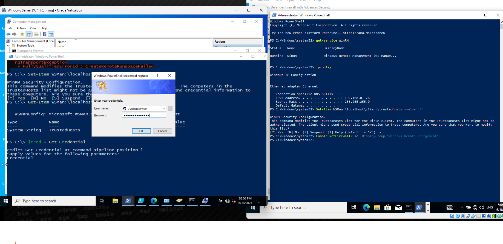
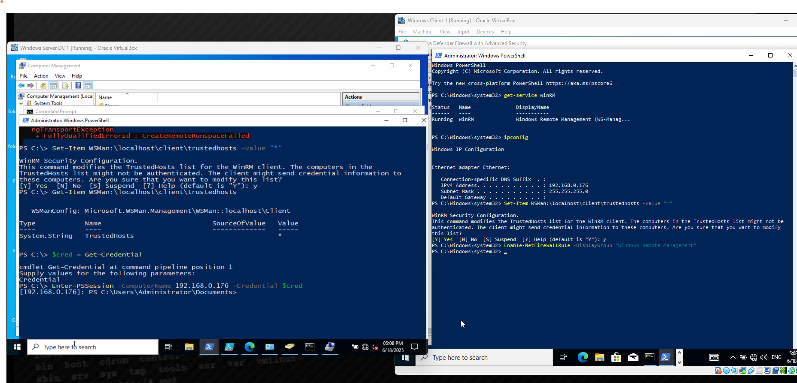
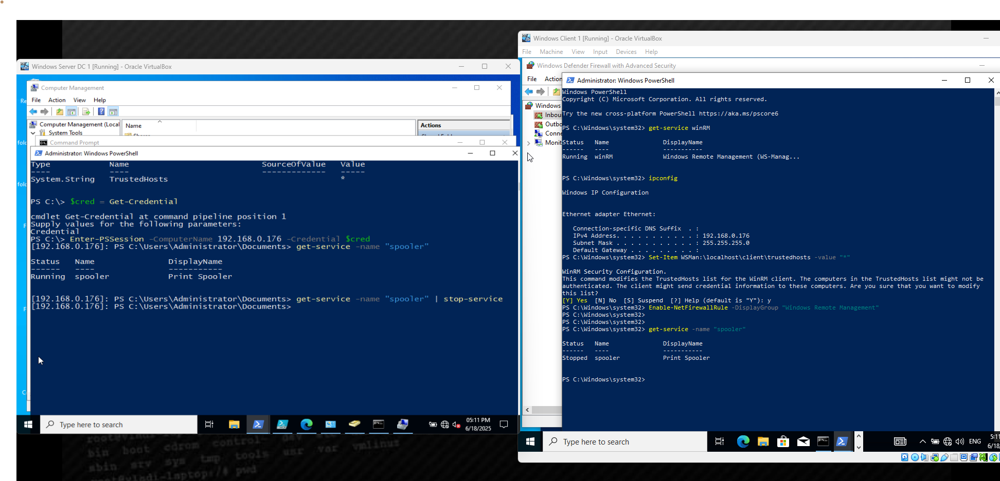
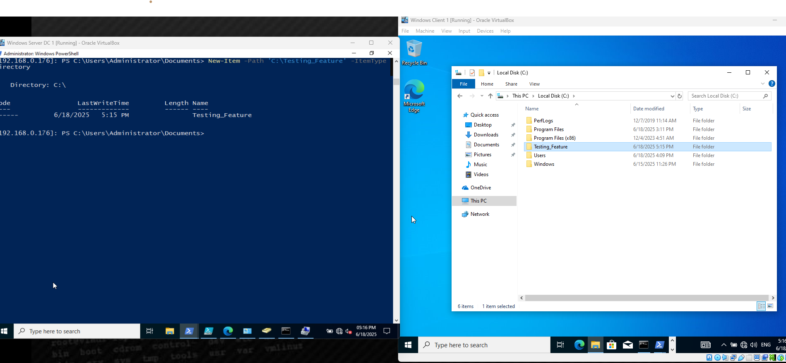
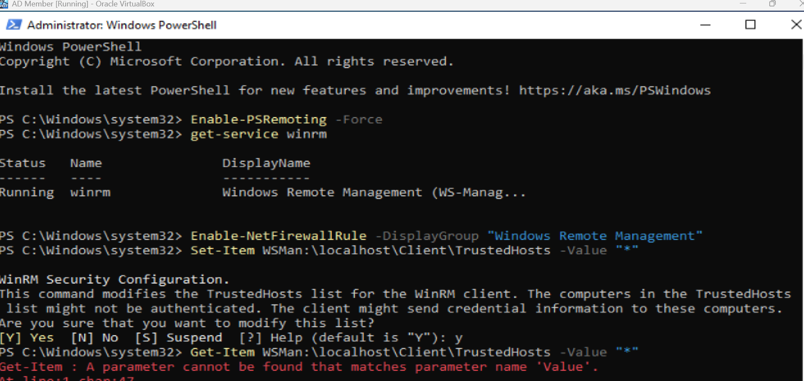
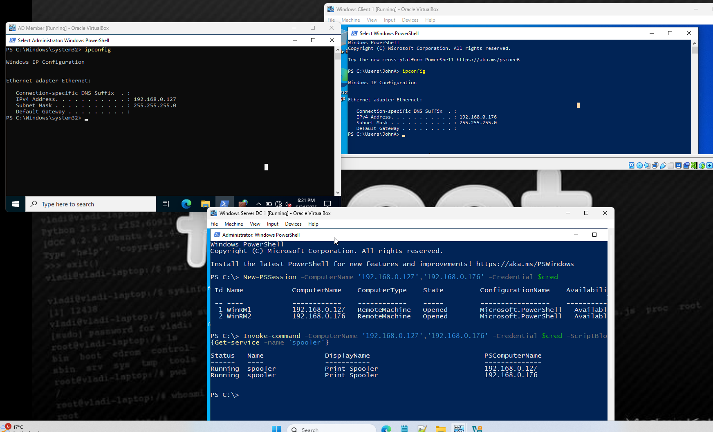

# psremote-spooler-lab
Remotely manage Windows client services using PowerShell Remoting (WinRM). This lab demonstrates enabling PS Remoting, initiating sessions from a domain controller, and managing the Print Spooler service securely.

# 💻 PowerShell Remoting Lab – Printer Spooler Service Management

This mini lab demonstrates how to remotely manage services on a Windows client machine using **PowerShell Remoting (WinRM)** from a **Domain Controller**.

---

## 🧩 What This Lab Covers

✅ Enabled **PowerShell Remoting** via `Enable-PSRemoting`  
✅ Set the **trusted host** using:
```powershell
Set-Item wsman:\localhost\client\trustedhosts -Value <client-machine-name>
```
✅ Used `New-PSSession` to initiate a remote session from DC to client  
✅ Executed `Get-Service -Name "Spooler"` remotely to check printer spooler service status  
✅ Demonstrated remote service management across domain-joined devices  

---

## 🔐 Why the Spooler?
The **Print Spooler** service is responsible for managing print jobs. Managing it remotely can be critical in environments with centralized print services or troubleshooting remote client printing issues.

---

## 📸 Screenshots

| Step | Description | Screenshot |
|------|-------------|------------|
| 1 | Enabling PS Remoting |  |
| 2 | Setting Trusted Hosts |  |
| 3 | Creating PSSession |  |
| 4 | Checking Spooler Status |  |
| 5 | Elevated Session for Troubleshooting |  |
| 6 | Successful Remote Management |  |

---

## 🧠 Community Question

> If a domain-joined client throws a **"Trust relationship between this workstation and the primary domain failed"** error — would using PowerShell remoting in elevated mode still allow you to repair it remotely with:
```powershell
Test-ComputerSecureChannel -Repair -Credential (Get-Credential)
```
**OR**
```powershell
Reset-ComputerMachinePassword -Credential "domain\username" -Server "DCName"
```

What are the **security implications** of this approach?

I’d love to hear your thoughts!

---

## 📂 Repository Structure

```bash
psremote-spooler-lab/
│
├── screenshots/
│   ├── enable-remoting.png
│   ├── set-trusted-host.png
│   ├── new-pssession.png
│   ├── get-spooler.png
│   ├── elevated-session.png
│   └── remote-output.png
│
└── README.md
```

---

## 🛡️ Note
Always apply strong authentication and encrypted channels (like HTTPS or SSL over WinRM) when using PowerShell Remoting in production.

---

## 🧠 Author
Built with curiosity and continuous learning 💡
